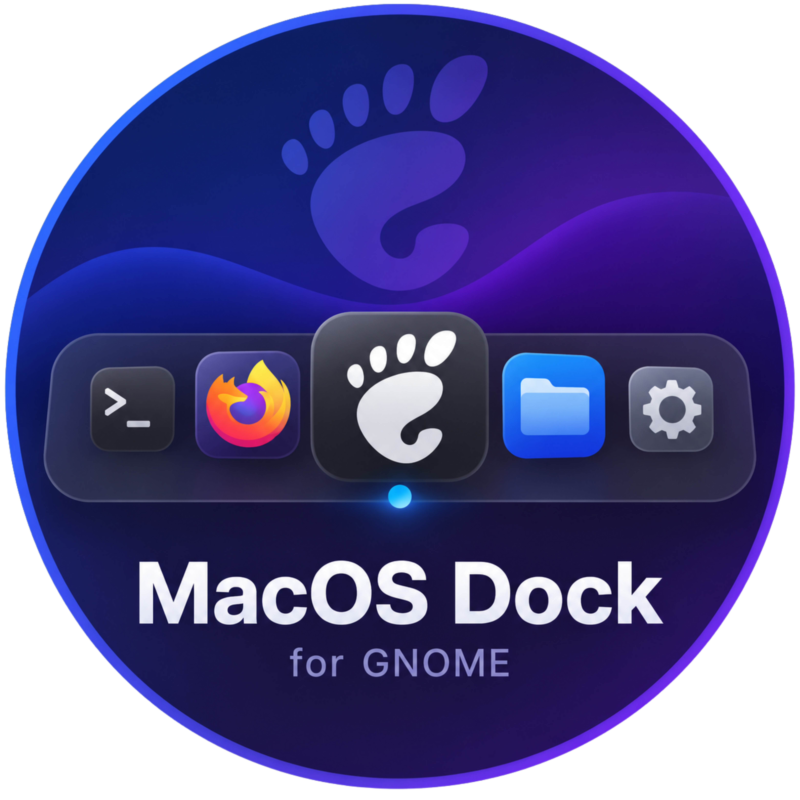
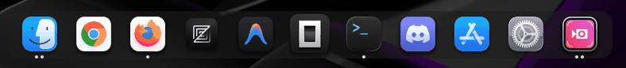

<p align="center">
  
</p>

<h1 align="center">MacOS Dock for GNOME Shell</h1>

<p align="center">
  A macOS-style dock extension for GNOME Shell featuring smooth magnification, configurable animations, and native-like behavior.
</p>

<p align="center">
  
</p>

## Features

- **Auto-hide dock** with configurable show/hide thresholds and smooth animations
- **Magnification effect** with adjustable scale and falloff distance
- **Running indicators** — dots per window (macOS style) or horizontal bar
- **Click-to-minimize** for focused applications
- **Window previews** — live thumbnail previews of open windows on hover
- **Dock customization** — adjustable opacity, background color, border radius, and blur effect
- **Multiple positions** — place the dock at the bottom, top, left, or right edge
- **Keyboard navigation** — Super+D to toggle dock, Super+1-9 to focus apps
- **Applications button** — access all installed apps from the dock
- **Configurable performance** settings for framerate, animation duration, and icon quality
- **Native GNOME integration** — hides the default dash to avoid conflicts

## Compatibility

- GNOME Shell 45+
- Tested on Fedora, Ubuntu, and Arch Linux

## Installation

### From Source

```bash
git clone https://github.com/vinnytherobot/MacOSDock.git
cd MacOSDock
make install
```

The extension will be installed to `~/.local/share/gnome-shell/extensions/macos-dock@vinnytherobot.github.io/`.

### Restart GNOME Shell

- **X11**: Press `Alt+F2`, type `r`, and press Enter
- **Wayland**: Log out and log back in

### Enable the Extension

```bash
gnome-extensions enable macos-dock@vinnytherobot.github.io
```

## Configuration

Access the extension preferences through GNOME Extensions app or:

```bash
gnome-extensions prefs macos-dock@vinnytherobot.github.io
```

### Settings

| Setting              | Description                             | Default |
| -------------------- | --------------------------------------- | ------- |
| Auto-hide            | Hide dock when pointer moves away       | Enabled |
| Bounce on launch     | Animate icon when app starts            | Enabled |
| Animation duration   | Show/hide animation time (ms)           | 200     |
| Show threshold       | Distance from edge to trigger show (px) | 25      |
| Enable magnification | Scale icons on hover                    | Enabled |
| Max scale            | Maximum magnification factor            | 1.4     |
| Falloff distance     | Magnification wave reach (px)           | 100     |
| Running indicators   | Show running app indicators             | Enabled |
| Indicator style      | Dots per window or horizontal bar       | Dots    |
| Framerate            | Animation framerate (Hz)                | 60      |
| Icon size            | Size of dock icons (16-96px)            | 48      |
| Icon quality         | Resolution multiplier (x1/x2/x4)       | x2      |
| Dock position        | Bottom, top, left, or right             | Bottom  |
| Dock opacity         | Background opacity (0-100%)             | 60      |
| Dock background      | Custom hex color for dock background    | #1e1e1e |
| Border radius        | Corner radius of dock (px)              | 16      |
| Enable blur          | Frosted glass effect behind dock        | Disabled|
| Keyboard navigation  | Enable keyboard shortcuts               | Enabled |
| Show applications    | Show apps button in dock                | Enabled |
| Window previews      | Show live thumbnails on hover           | Enabled |
| Preview width        | Width of preview thumbnails (100-400px) | 200     |

### Keyboard Shortcuts

| Shortcut       | Action                     |
| -------------- | -------------------------- |
| Super+D        | Toggle dock visibility     |
| Super+1-9      | Focus app 1-9 in dock      |
| Super+0        | Focus app 10 in dock       |

## Development

### Prerequisites

- Node.js 18+
- TypeScript 5+
- GNOME Shell SDK (for type definitions)

### Build

```bash
npm install
npm run build
```

### Watch Mode

```bash
npm run watch
```

### Lint

```bash
npm run lint
```

### Package for Distribution

```bash
make zip
```

This creates a `.zip` file ready for upload to [extensions.gnome.org](https://extensions.gnome.org).

## License

This project is licensed under the MIT License — see the [LICENSE](LICENSE) file for details.

## Contributing

Contributions are welcome. Please read [CONTRIBUTING.md](CONTRIBUTING.md) before submitting a pull request.

## Acknowledgments

- GNOME Shell extension development community
- Dash-to-Dock project for inspiration on native dash hiding techniques
